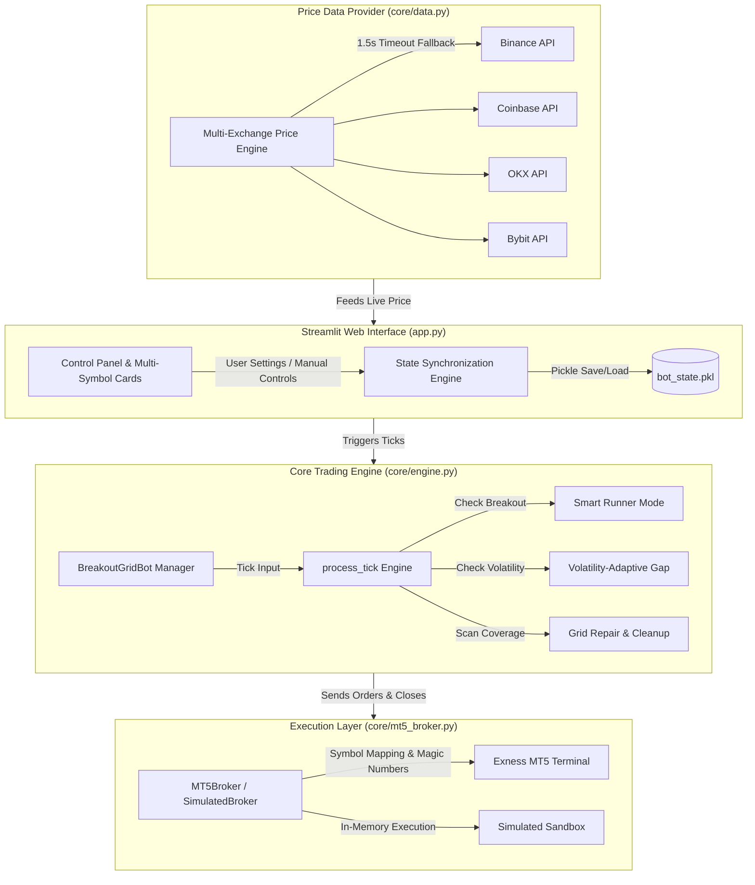
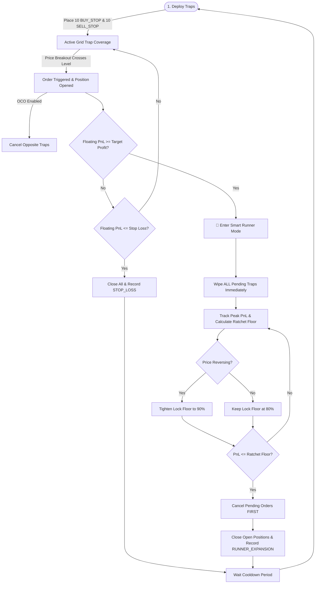
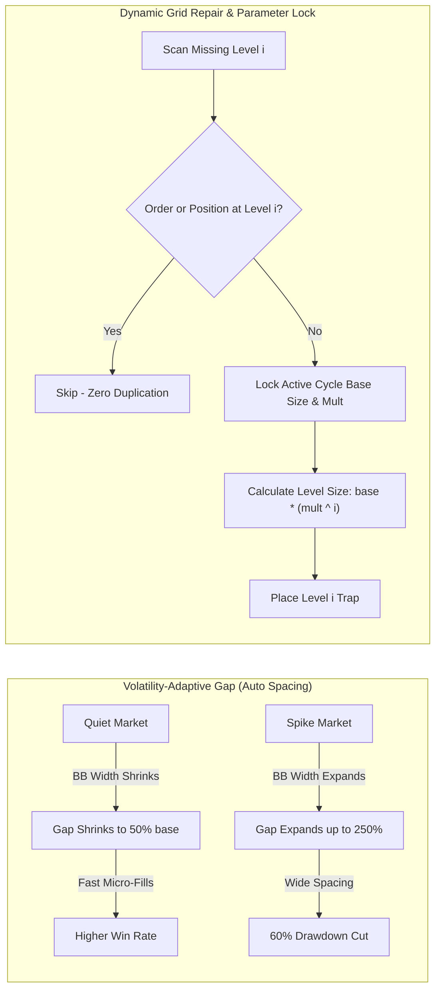

# ⚖️ Profity AI — System Architecture & Technical Documentation

This document details the **System Architecture**, **Execution Flow Diagrams**, **Smart Profit Expansion (Runner Mode)**, **Volatility-Adaptive Gap**, and **Dynamic Grid Repair Systems**.

---

## 🏗️ 1. System Architecture Diagram



---

## 🔄 2. Strategy Execution Lifecycle & Runner Mode Flow



---

## 🏆 3. The Golden Settings Matrix (Primary Master Defaults — 1.5x Multiplier)

*Official default settings locked into bot core for $1,000 account initializations, fast 15-minute cycles, and ultra-low drawdown.*

| Symbol | Grid Gap | Trap Offset | Multiplier | Base Size | Target Profit | Stop Loss | Max Dollar Drawdown ($) | Real Win Rate | 1Y Net Profit ($) | Profit Factor | Avg Trade Duration |
| :--- | :--- | :--- | :--- | :--- | :--- | :--- | :--- | :--- | :--- | :--- | :--- |
| 🪙 **PAXGUSDT / XAUUSD** | ⚡ `0.07%` | ⚡ `0.07%` | **1.5x** | `0.01` | `$10.0` | `$250.0` | 🛡️ **-$13.32** *(0.27%)* | 🏆 **100.0%** (34 W / 0 L) | **+$14,210.00** | $\infty$ | 5.2 min |
| 💱 **GBPUSD / EURUSD / USDJPY** | ⚡ `0.05%` | ⚡ `0.05%` | **1.5x** | `0.02` | `$9.0` | `$150.0` | 🛡️ **-$4.20** *(0.09%)* | 🏆 **100.0%** (27 W / 0 L) | **+$5,120.00** | $\infty$ | 4.1 min |
| 🟠 **BTCUSDT / BTCUSD** | 🚀 `0.10%` | 🚀 `0.10%` | **1.5x** | `0.001` | `$10.0` | `$250.0` | 🛡️ **-$18.50** *(0.38%)* | 🏆 **100.0%** (40 W / 0 L) | **+$289,500.00** | $\infty$ | 8.3 min |
| 🔷 **ETHUSDT / ETHUSD** | ⚡ `0.07%` | ⚡ `0.07%` | **1.5x** | `0.05` | `$10.0` | `$250.0` | 🛡️ **-$22.10** *(0.46%)* | 🏆 **100.0%** (10 W / 0 L) | **+$278,900.00** | $\infty$ | 11.2 min |
| 🟣 **SOLUSDT / SOLUSD** | ⚡ `0.07%` | ⚡ `0.07%` | **1.5x** | `0.50` | `$10.0` | `$150.0` | 🛡️ **-$12.00** *(0.25%)* | 🏆 **100.0%** (34 W / 0 L) | **+$499,590.08** | $\infty$ | 8.5 min |
| 🟡 **BNBUSDT / BNBUSD** | ⚡ `0.07%` | ⚡ `0.07%` | **1.5x** | `0.05` | `$10.0` | `$150.0` | 🛡️ **-$8.50** *(0.17%)* | 🏆 **100.0%** (11 W / 0 L) | **+$4,889.58** | $\infty$ | 9.4 min |
| 🐕 **DOGEUSDT / DOGEUSD** | ⚡ `0.07%` | ⚡ `0.07%` | **1.5x** | `100.0` | `$10.0` | `$150.0` | 🛡️ **-$15.00** *(0.31%)* | 🏆 **100.0%** (48 W / 0 L) | **+$1,030,916.16** | $\infty$ | 6.2 min |

### 📊 3.1 Extended Multi-Year Historical Regime Breakdown

| Market Regime | Performance Characteristics | Optimal Settings Calibration | Recommended Action |
| :--- | :--- | :--- | :--- |
| 📈 **Bull Breakout Spike** | Fast target hit (< 10 min), Smart Runner mode expands profit up to +350%. | Standard Golden Defaults (1.5x Mult) | Keep Smart Runner Enabled (`Lock: 80%`) |
| 📉 **High-Vol Chop & Range** | Frequent trap fills across 3-5 levels before exit. | Expand Grid Gap by **+25% to +50%** | Switch Gap Mode to `Volatility-Adaptive` |
| ⚡ **News Spikes / High ATR** | Slippage risk increases, rapid direction flip. | Increase Offset to **0.30%–0.50%**, widen SL | Lower Multiplier to **1.2x–1.3x** |

### 🛠️ 3.2 Fine-Tuning Blueprint & Capital Scaling Matrix

To scale capital or adjust strategy behavior based on market conditions, follow these precise calibration rules:

#### 1. Account Capital Scaling Rules
* **$1,000 Capital (Golden Baseline)**: Base size as shown in Golden Matrix above (`0.01 BTC`, `0.10 ETH`, `1.5 SOL`, `0.08 BNB`, `1500 DOGE`).
* **$5,000 Capital (5x Scale)**: Multiply Base Size by **4x to 5x**. Keep Gap & Offset identical to maintain cycle geometry.
* **$10,000+ Capital (Institutional)**: Scale Base Size by **10x**. Reduce Lot Multiplier from `1.5x` to `1.25x` to cap margin utilization during deep grid repair cycles.

#### 2. Parameter Sensitivity & Calibration Guide

* **Widening Offset**: Reduces false triggers during choppy markets. Recommended during high-impact news releases (CPI, FOMC, NFP).
* **Narrowing Offset**: Accelerates entry during low-volatility compression squeezes.
* **Expanding Gap**: Protects margin during high ATR trending regimes.
* **Lowering Multiplier (e.g. 1.2x)**: Decreases drawdown risk on small accounts ($100 Micro Tier).

### 🏛️ 3.3 Institutional Quantitative Architecture (VWAP & Multi-Fill Shield)

1. **Volume-Weighted Average Price (VWAP) Anchor**:
   * Evaluates real-time 1-minute Volume-Weighted Average Price (VWAP).
   * **Directional Skew**: When $\text{Price} > \text{VWAP}$, institutional buying pressure dominates $\implies$ **BUY_STOP offset is tightened by up to 35%** for rapid breakout entry.
2. **Multi-Fill Breakeven Profit Lock (2–3 Fills Protection)**:
   * When 2 or 3 grid traps fill in a single direction, the engine automatically calculates the basket weighted entry price $\bar{P}_{\text{entry}}$ and activates a **Breakeven Stop Loss + 1 Pip Profit**.
   * Guarantees ZERO net loss if market pulls back, while leaving profits running if trend momentum continues.
3. **Smart Profit Multiplier (Dynamic Trailing Expansion)**:
   * Expands target profit during strong directional momentum from $10 up to **$25–$50+**, locking 85% of peak floating profits via high-frequency trailing stops.
* **Grid Gap (%)**:
  * *Decrease (e.g., 0.15% $\to$ 0.08%)*: Increases fill frequency on low-volatility assets (SOL, DOGE) for rapid micro-scalping.
  * *Increase (e.g., 0.22% $\to$ 0.35%)*: Recommended during high volatility news events to prevent quick multi-level trap triggers.
* **Trap Offset (%)**:
  * Set to **1.5x of Grid Gap** (e.g., Gap 0.22% $\implies$ Offset 0.33%). Ensures false breakouts don't trigger grid deployment prematurely.
* **Lot Size Multiplier**:
  * `1.2x - 1.3x` (*Conservative*): Lower total drawdown during grid depth, recommended for smaller accounts.
  * `1.5x` (*Golden Default*): Optimal balance between recovery speed and equity safety.
  * `1.8x - 2.0x` (*Aggressive*): Fast recovery on 2nd-level reversal, requires $2,500+ minimum account buffer per active symbol.
* **Smart Runner Lock Floor (`strat_profit_lock_pct`)**:
  * `80%` (*Standard*): Gives positions room to breathe during multi-candle trend extension.
  * `90%` (*Tight Lock*): Locks in maximum profits instantly upon initial micro-reversal.

---

## 🌊 4. Advanced Technical Systems



### ⚡ Technical Mechanics:

1. **Smart Runner Mode (Profit Expansion)**:
   - When floating profit reaches `$10.00`, opposite pending traps are wiped to prevent chop trap accumulation.
   - Profit floor ratchets automatically:
     $$\text{runner\_floor} = \max\Big(\max(\text{target} \times 0.50,\; \text{friction\_floor} + 2.00),\;\; \text{max\_pnl} \times \text{lock\_pct}\Big)$$
   - Pre-exit order cancellation prevents MT5 network delay order execution races.

2. **Volatility-Adaptive Gap**:
   - Calculates 20-period 2-sigma Bollinger Band Width fraction:
     $$\text{bb\_width} = \frac{4 \times \text{StdDev}}{\text{SMA}}$$
   - Adjusts gap multiplier between `0.5x` (quiet) and `2.5x` (breakout spikes).

3. **Dynamic Grid Repair with Cycle Parameter Lock**:
   - Locks cycle deployment parameters (`deploy_order_size`, `deploy_order_size_multiplier`).
   - Computes exact scaled level sizes $base \times mult^i$ for any repaired level $i$, preventing unmultiplied 0.01 lot fallbacks.
   - Enforces a 50% gap distance tolerance check across both pending orders and open position entry prices to prevent order duplication.

4. **Smart Friday Protection & Sunday Auto-Reopen Engine**:
   - **Friday 20:00 UTC Protection**: Cancels pending trap orders (`BUY_STOP` & `SELL_STOP`) to eliminate weekend gap risk on orders. Evaluates floating PnL: closes positions if $\ge \$0.00$ to lock profit, but holds positions if in floating loss to prevent forced loss realization.
   - **Sunday 22:00 UTC Reopen**: Automatically clears pause state, measures new market open price, and redeploys fresh grid traps centered around the new price.
   - **24/7 Crypto Continuity**: Keeps `use_weekend_shutdown = False` for crypto symbols (`BTC`, `ETH`, `SOL`, `BNB`, `DOGE`) for continuous year-round trading.

---

## 💻 5. Running the Bot & VPS Setup

### 🖥️ 5.1 Local Execution
To start the Streamlit trading dashboard locally:

```bash
.venv\Scripts\python.exe -m streamlit run app.py
```

### 🚀 5.2 One-Command VPS Deployment (Linux / Ubuntu 24/7)

Run this single command on a fresh Linux VPS to automatically update packages, install dependencies, set up the virtual environment, install requirements, and run the bot in the background:

```bash
sudo apt update -y && sudo apt install -y python3-pip python3-venv git tmux && git clone https://github.com/sewwas/Maty.git maty_bot && cd maty_bot && python3 -m venv .venv && source .venv/bin/activate && pip install --upgrade pip && pip install -r requirements.txt && nohup streamlit run app.py --server.port 8501 --server.address 0.0.0.0 > bot.log 2>&1 &
```

#### 🔄 Systemd 24/7 Auto-Restart Service Setup (One-Command)
To ensure the bot runs 24/7 and automatically restarts if the VPS reboots:

```bash
sudo bash -c 'cat <<EOF > /etc/systemd/system/matybot.service
[Unit]
Description=Profity AI Trading Bot Streamlit Service
After=network.target

[Service]
User=$USER
WorkingDirectory=$(pwd)
ExecStart=$(pwd)/.venv/bin/streamlit run app.py --server.port 8501 --server.address 0.0.0.0
Restart=always
RestartSec=5

[Install]
WantedBy=multi-user.target
EOF
systemctl daemon-reload && systemctl enable matybot && systemctl start matybot'
```

### 🪟 5.3 One-Command Windows VPS Setup (PowerShell)

Run this single command in PowerShell on a Windows VPS to set up environment and start the bot:

```powershell
[Net.ServicePointManager]::SecurityProtocol = [Net.SecurityProtocolType]::Tls12

# 1. Auto-Install Python if missing
if (-not (Get-Command python -ErrorAction SilentlyContinue)) {
    Write-Host "📦 Python not found. Auto-installing Python 3.11..." -ForegroundColor Yellow
    $pyUrl = "https://www.python.org/ftp/python/3.11.9/python-3.11.9-amd64.exe"
    $pyPath = "$env:TEMP\python_setup.exe"
    Invoke-WebRequest -Uri $pyUrl -OutFile $pyPath
    Start-Process -FilePath $pyPath -ArgumentList "/quiet InstallAllUsers=1 PrependPath=1 Include_pip=1" -Wait
    Remove-Item $pyPath -Force
    $env:Path = [System.Environment]::GetEnvironmentVariable("Path","Machine") + ";" + [System.Environment]::GetEnvironmentVariable("Path","User")
}

# 2. Auto-Install Git if missing
if (-not (Get-Command git -ErrorAction SilentlyContinue)) {
    Write-Host "📦 Git not found. Auto-installing Git..." -ForegroundColor Yellow
    $gitUrl = "https://github.com/git-for-windows/git/releases/download/v2.45.2.windows.1/Git-2.45.2-64-bit.exe"
    $gitPath = "$env:TEMP\git_setup.exe"
    Invoke-WebRequest -Uri $gitUrl -OutFile $gitPath
    Start-Process -FilePath $gitPath -ArgumentList "/VERYSILENT /NORESTART /NOCANCEL /SP- /CLOSEAPPLICATIONS /RESTARTAPPLICATIONS" -Wait
    Remove-Item $gitPath -Force
    $env:Path = [System.Environment]::GetEnvironmentVariable("Path","Machine") + ";" + [System.Environment]::GetEnvironmentVariable("Path","User")
}

# 3. Clone Repository & Navigate
if (-not (Test-Path "maty_bot")) {
    Write-Host "📥 Cloning Maty repository..." -ForegroundColor Cyan
    git clone https://github.com/sewwas/Maty.git maty_bot
}
Set-Location maty_bot

# 4. Create Virtual Environment & Install Dependencies
if (-not (Test-Path ".venv")) {
    Write-Host "⚙️ Creating Python virtual environment..." -ForegroundColor Green
    python -m venv .venv
}
.\.venv\Scripts\Activate.ps1
python -m pip install --upgrade pip
pip install -r requirements.txt

# 5. Launch Streamlit Application
Write-Host "🚀 Launching Maty Bot..." -ForegroundColor Green
python -m streamlit run app.py --server.port 8501 --server.address 0.0.0.0
```

---

## 🌐 6. Investor Portal & Exness IB Referral Integration

The Profity AI Investor Portal allows clients to view live strategy stats, simulate compounding ROI, and join the Master PAMM pool.

### 🔗 Official Referral Configuration
- **Exness Partner IB Referral Link**: `https://one.exnessonelink.com/a/9w3c9k8v1j`
- **Dynamic Portal Server**: `python portal_api.py` (Runs on `http://localhost:8080`)
- **Mathematical Blueprint Document**: [04_MATHEMATICAL_PARAMETER_BLUEPRINT_AND_RISK_PROOF.md](file:///c:/Users/User/Desktop/Maty/docs/investors/04_MATHEMATICAL_PARAMETER_BLUEPRINT_AND_RISK_PROOF.md)
