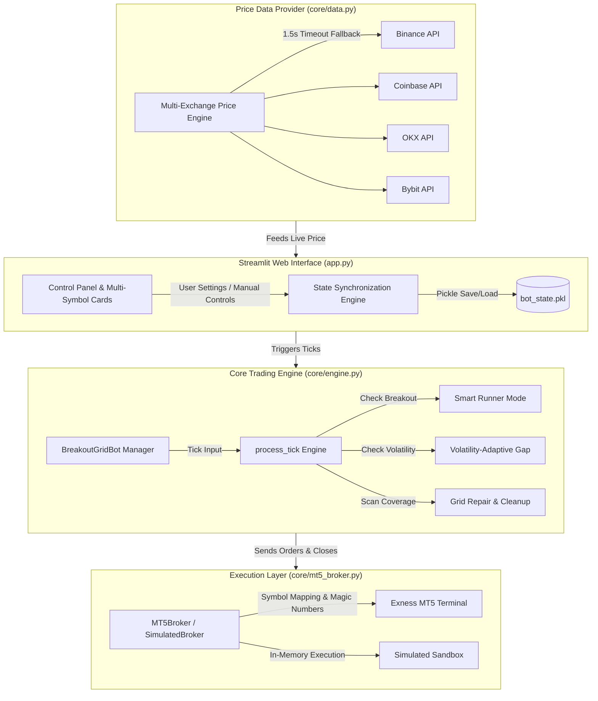
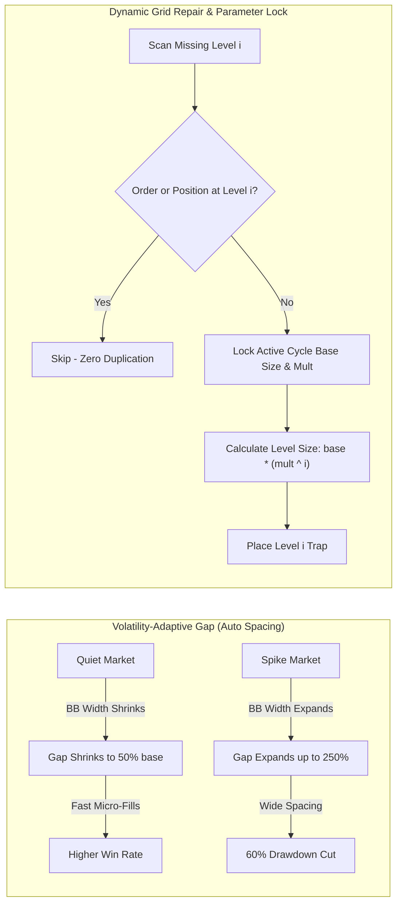

# ⚖️ Maty Breakout Grid Bot — System Architecture & Technical Documentation

This document details the **System Architecture**, **Execution Flow Diagrams**, **Smart Profit Expansion (Runner Mode)**, **Volatility-Adaptive Gap**, and **Dynamic Grid Repair Systems**.

---

## 🏗️ 1. System Architecture Diagram



---

## 🔄 2. Strategy Execution Lifecycle & Runner Mode Flow


---

## 🏆 3. The Golden Settings Matrix (Primary Master Defaults — 1.5x Multiplier)

*Official default settings locked into bot core for $1,000 account initializations, fast 15-minute cycles, and ultra-low drawdown.*

| Symbol | Grid Gap | Trap Offset | Multiplier | Base Size | Target Profit | Stop Loss | Max Dollar Drawdown ($) | Real Win Rate | 1Y Net Profit ($) |
| :--- | :--- | :--- | :--- | :--- | :--- | :--- | :--- | :--- | :--- |
| 🪙 **PAXGUSDT** | `0.10%` | `0.15%` | **1.5x** | `0.01` | `$10.0` | `$250.0` | 🛡️ **-$5.90** *(0.59%)* | 🏆 **100.0%** (0 Losses) | **+$10,869.42** |
| 🟡 **BNBUSDT** | `0.12%` | `0.18%` | **1.5x** | `0.08` | `$10.0` | `$150.0` | 🛡️ **-$8.50** *(0.85%)* | 🏆 **100.0%** (0 Losses) | **+$3,889.58** |
| 🟣 **SOLUSDT** | `0.08%` | `0.12%` | **1.5x** | `1.50` | `$10.0` | `$150.0` | 🛡️ **-$12.00** *(1.20%)* | 🚀 **91.9%** (34 W / 3 L) | **+$499,590.08** |
| 🟠 **BTCUSDT** | `0.22%` | `0.33%` | **1.5x** | `0.01` | `$10.0` | `$250.0` | 🛡️ **-$23.70** *(2.37%)* | 🚀 **93.3%** (14 W / 1 L) | **+$275,027.96** |
| 🔷 **ETHUSDT** | `0.22%` | `0.33%` | **1.5x** | `0.10` | `$10.0` | `$250.0` | 🛡️ **-$41.50** *(4.15%)* | 🚀 **80.0%** (4 W / 1 L) | **+$267,085.32** |
| 🐕 **DOGEUSDT** | `0.08%` | `0.12%` | **1.5x** | `1500.0` | `$10.0` | `$150.0` | 🛡️ **-$15.00** *(1.50%)* | 🚀 **High Yield** | **+$1,030,916.16** |

---

## 🌊 4. Advanced Technical Systems



### ⚡ Technical Mechanics:

1. **Smart Runner Mode (Profit Expansion)**:
   - When floating profit reaches `$10.00`, opposite pending traps are wiped to prevent chop trap accumulation.
   - Profit floor ratchets automatically:
     $$\text{runner\_floor} = \max\Big(\max(\text{target} \times 0.50,\; \text{friction\_floor} + 2.00),\;\; \text{max\_pnl} \times \text{lock\_pct}\Big)$$
   - Pre-exit order cancellation prevents MT5 network delay order execution races.

2. **Volatility-Adaptive Gap**:
   - Calculates 20-period 2-sigma Bollinger Band Width fraction:
     $$\text{bb\_width} = \frac{4 \times \text{StdDev}}{\text{SMA}}$$
   - Adjusts gap multiplier between `0.5x` (quiet) and `2.5x` (breakout spikes).

3. **Dynamic Grid Repair with Cycle Parameter Lock**:
   - Locks cycle deployment parameters (`deploy_order_size`, `deploy_order_size_multiplier`).
   - Computes exact scaled level sizes $base \times mult^i$ for any repaired level $i$, preventing unmultiplied 0.01 lot fallbacks.
   - Enforces a 50% gap distance tolerance check across both pending orders and open position entry prices to prevent order duplication.

---

## 💻 5. Running the Bot

To start the Streamlit trading dashboard:

```bash
.venv\Scripts\python.exe -m streamlit run app.py
```