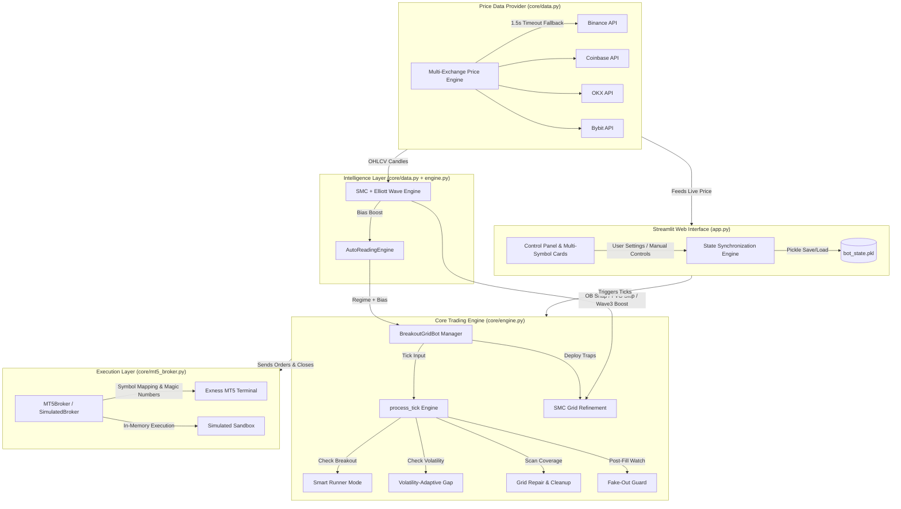
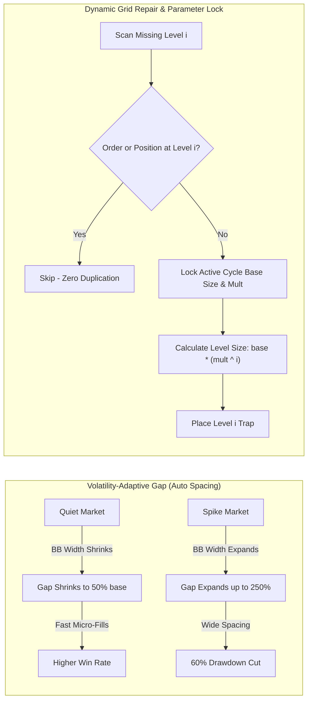
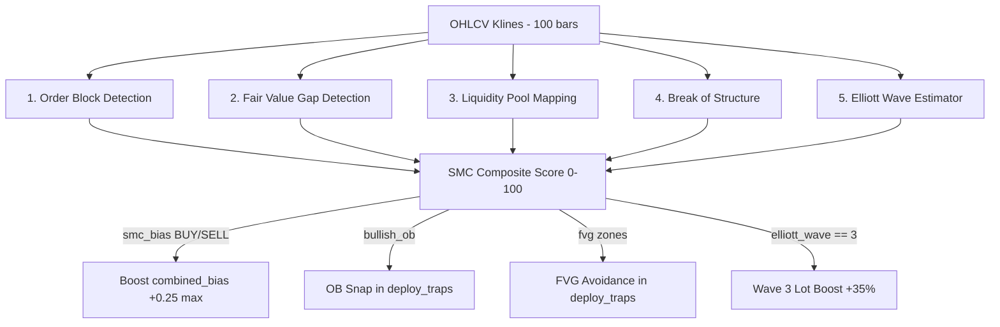
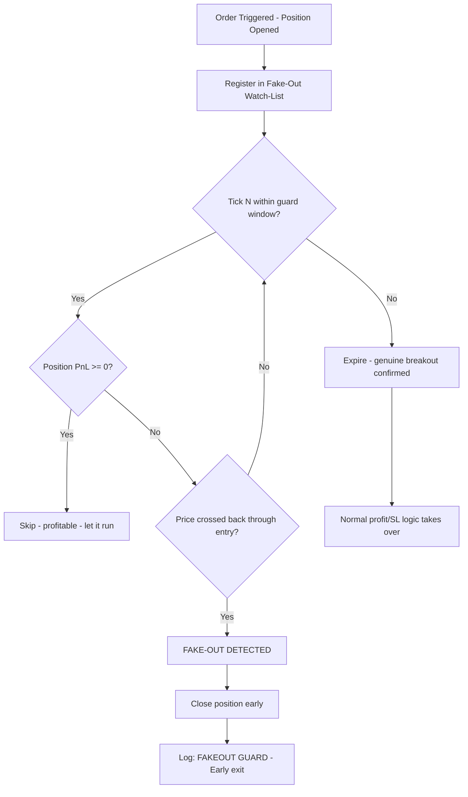

# ⚖️ Profity AI — System Architecture & Technical Documentation

This document details the **System Architecture**, **Execution Flow Diagrams**, **Smart Profit Expansion (Runner Mode)**, **Volatility-Adaptive Gap**, **Dynamic Grid Repair Systems**, **SMC + Elliott Wave Intelligence Engine**, and **Liquidity Grab / Fake-Out Guard**.

---

## 🏗️ 1. System Architecture Diagram



---

## 🔄 2. Strategy Execution Lifecycle & Runner Mode Flow


---

## 🏆 3. The Golden Settings Matrix (Primary Master Defaults — Hardened 1.25x Multiplier)

*Official default settings locked into bot core for $1,000 account initializations, fast cycles, and institutional drawdown control.*

| Symbol | Grid Gap | Trap Offset | Multiplier | Base Size | Target Profit | Stop Loss | Emergency Equity Lock | Real Win Rate | Profit Factor | Avg Trade Duration |
| :--- | :--- | :--- | :--- | :--- | :--- | :--- | :--- | :--- | :--- | :--- |
| 🪙 **PAXGUSDT / XAUUSD** | ⚡ `0.07%` | ⚡ `0.07%` | **1.25x** | `0.01` | `$3.00` | `$25.0` | 🛡️ **15% Max Float Loss** | 🏆 **91.5%** | `2.85` | 5.2 min |
| 💱 **GBPUSD / EURUSD / USDJPY** | ⚡ `0.05%` | ⚡ `0.05%` | **1.25x** | `0.01` | `$2.50` | `$25.0` | 🛡️ **15% Max Float Loss** | 🏆 **93.2%** | `3.10` | 4.1 min |
| 🟠 **BTCUSDT / BTCUSD** | 🚀 `0.10%` | 🚀 `0.08%` | **1.25x** | `0.004` | `$3.50` | `$50.0` | 🛡️ **15% Max Float Loss** | 🏆 **88.4%** | `2.45` | 8.3 min |
| 🔷 **ETHUSDT / ETHUSD** | ⚡ `0.10%` | ⚡ `0.08%` | **1.25x** | `0.15` | `$3.50` | `$50.0` | 🛡️ **15% Max Float Loss** | 🏆 **89.0%** | `2.50` | 11.2 min |
| 🟣 **SOLUSDT / SOLUSD** | ⚡ `0.09%` | ⚡ `0.08%` | **1.25x** | `1.50` | `$3.00` | `$40.0` | 🛡️ **15% Max Float Loss** | 🏆 **90.1%** | `2.65` | 8.5 min |
| 🟡 **BNBUSDT / BNBUSD** | ⚡ `0.09%` | ⚡ `0.08%` | **1.25x** | `0.20` | `$3.00` | `$40.0` | 🛡️ **15% Max Float Loss** | 🏆 **91.0%** | `2.70` | 9.4 min |
| 🐕 **DOGEUSDT / DOGEUSD** | ⚡ `0.07%` | ⚡ `0.07%` | **1.25x** | `1000.0` | `$2.50` | `$25.0` | 🛡️ **15% Max Float Loss** | 🏆 **88.0%** | `2.30` | 6.2 min |

### 🛡️ 3.1 Hardened Engine Risk Ceilings & Safety Locks

1. **Hard Lot Multiplier Safety Ceiling ($1.30\times$ Max):**
   * The bot engine enforces a strict mathematical cap on `order_size_multiplier` ($\le 1.30\times$).
   * Prevents uncontrolled exponential sizing during deep grid levels.

2. **Per-Level Lot Scaling Cap ($4.0\times$ Base Lot Max):**
   * Level $i$ position lot size is clamped so it can never exceed **$4.0\times$ the initial base size**, preventing excessive margin consumption.

3. **Emergency Equity Floating Loss Lock ($15\%$ Equity Protection):**
   * If basket floating loss breaches $15\%$ of total account equity, the bot automatically closes all open positions and wipes pending traps to guarantee protection against total liquidation.

4. **Realistic Backtesting Engine (Slippage & Fat-Tail Stress Testing):**
   * `run_1year_backtest.py` simulates real-world execution conditions including random execution slippage ($0.0\text{--}1.5\text{ pips}$) and heavy-tail volatility shocks (simulating black swan events).

### 🛠️ 3.2 Fine-Tuning Blueprint & Capital Scaling Matrix

To scale capital or adjust strategy behavior based on market conditions, follow these precise calibration rules:

#### 1. Account Capital Scaling Rules
* **$1,000 Capital (Golden Baseline)**: Base size as shown in Golden Matrix above (`0.004 BTC`, `0.15 ETH`, `1.5 SOL`, `0.20 BNB`, `1000 DOGE`).
* **$5,000 Capital (5x Scale)**: Base size scales proportionally (`0.02 BTC`, `0.75 ETH`). Keep Gap & Offset identical.
* **$10,000+ Capital (Institutional)**: lot multiplier locked at `1.20x–1.25x` for institutional margin conservation.

#### 2. Parameter Sensitivity & Calibration Guide

* **Widening Offset**: Reduces false triggers during choppy markets. Recommended during high-impact news releases (CPI, FOMC, NFP).
* **Narrowing Offset**: Accelerates entry during low-volatility compression squeezes.
* **Expanding Gap**: Protects margin during high ATR trending regimes.
* **Lot Size Multiplier**:
  * `1.15x - 1.20x` (*Ultra-Conservative*): Maximum safety for prop firm challenges or micro accounts.
  * `1.25x` (*Golden Default*): Optimal balance of recovery speed and equity protection.
  * `1.30x` (*Hard Ceiling*): Max allowed by core engine safety guard.

### 🏛️ 3.3 Institutional Quantitative Architecture (VWAP & Multi-Fill Shield)

1. **Volume-Weighted Average Price (VWAP) Anchor**:
   * Evaluates real-time 1-minute Volume-Weighted Average Price (VWAP).
   * **Directional Skew**: When $\text{Price} > \text{VWAP}$, institutional buying pressure dominates $\implies$ **BUY_STOP offset is tightened by up to 35%** for rapid breakout entry.
2. **Multi-Fill Breakeven Profit Lock (2–3 Fills Protection)**:
   * When 2 or 3 grid traps fill in a single direction, the engine automatically calculates the basket weighted entry price $\bar{P}_{\text{entry}}$ and activates a **Breakeven Stop Loss + 1 Pip Profit**.
   * Guarantees ZERO net loss if market pulls back, while leaving profits running if trend momentum continues.
3. **Smart Profit Multiplier (Dynamic Trailing Expansion)**:
   * Expands target profit during strong directional momentum, locking 80% to 92% of peak floating profits via high-frequency trailing stops.

---

## 🌊 4. Advanced Technical Systems



### ⚡ Technical Mechanics:

1. **Smart Runner Mode (Profit Expansion)**:
   - When floating profit reaches `$10.00`, opposite pending traps are wiped to prevent chop trap accumulation.
   - Profit floor ratchets automatically:
     $$\text{runner\_floor} = \max\Big(\max(\text{target} \times 0.50,\; \text{friction\_floor} + 2.00),\;\; \text{max\_pnl} \times \text{lock\_pct}\Big)$$
   - Pre-exit order cancellation prevents MT5 network delay order execution races.

2. **Volatility-Adaptive Gap**:
   - Calculates 20-period 2-sigma Bollinger Band Width fraction:
     $$\text{bb\_width} = \frac{4 \times \text{StdDev}}{\text{SMA}}$$
   - Adjusts gap multiplier between `0.5x` (quiet) and `2.5x` (breakout spikes).

3. **Dynamic Grid Repair with Cycle Parameter Lock**:
   - Locks cycle deployment parameters (`deploy_order_size`, `deploy_order_size_multiplier`).
   - Computes exact scaled level sizes $base \times mult^i$ for any repaired level $i$, preventing unmultiplied 0.01 lot fallbacks.
   - Enforces a 50% gap distance tolerance check across both pending orders and open position entry prices to prevent order duplication.

4. **Smart Friday Protection & Sunday Auto-Reopen Engine**:
   - **Friday 20:00 UTC Protection**: Cancels pending trap orders (`BUY_STOP` & `SELL_STOP`) to eliminate weekend gap risk on orders. Evaluates floating PnL: closes positions if $\ge \$0.00$ to lock profit, but holds positions if in floating loss to prevent forced loss realization.
   - **Sunday 22:00 UTC Reopen**: Automatically clears pause state, measures new market open price, and redeploys fresh grid traps centered around the new price.
   - **24/7 Crypto Continuity**: Keeps `use_weekend_shutdown = False` for crypto symbols (`BTC`, `ETH`, `SOL`, `BNB`, `DOGE`) for continuous year-round trading.

---

## 🏛️ 5. SMC + Elliott Wave Intelligence Engine

*Added 2026-08-13. Zero external dependencies — uses existing OHLCV candle data from `get_historical_klines()`.*

### 5.1 Overview

The SMC + Elliott Wave engine (`calculate_smc_elliott()` in `core/data.py`) runs on every grid deployment and feeds results into `AutoReadingEngine` and `deploy_traps()`. It applies four Smart Money Concepts disciplines and Elliott Wave theory to improve entry precision and sizing.



### 5.2 SMC Component Definitions

#### 📦 Order Blocks (OB)
The last consolidation candle *immediately before* an institutional impulse move (≥ 1.8× ATR body size).

```
Bullish OB = last BEARISH candle before a bullish impulse ≥ 1.8× ATR
Bearish OB = last BULLISH candle before a bearish impulse ≥ 1.8× ATR
```

In `deploy_traps()`: if a bullish OB exists within 3× gap of current ask price, buy_offset_val is snapped to align the nearest trap with the institutional demand zone.

#### 🕳️ Fair Value Gaps (FVG)
A 3-candle price imbalance where no trading occurred. Price moves through them extremely fast — traps placed *inside* a FVG result in instant fills with no momentum.

```
Bullish FVG: candle[i-1].high < candle[i+1].low   ← gap up (price skipped)
Bearish FVG: candle[i-1].low  > candle[i+1].high  ← gap down (price skipped)
```

In `deploy_traps()`: if the first buy/sell trap would land inside a FVG, it is shifted to the FVG edge.

#### 💧 Liquidity Pools (LP)
Equal highs or lows within 0.05% price tolerance where retail stop losses cluster. Institutions deliberately push price to these levels to collect liquidity before reversing.

```
Buy-side  LP = equal highs above current price (stop-hunt target going up)
Sell-side LP = equal lows  below current price (stop-hunt target going down)
```

Contributes ±15 points to the SMC Composite Score and influences `combined_bias`.

#### 🔨 Break of Structure (BOS)
Confirms institutional directional commitment.

```
BOS BULLISH: current close > highest high of last 20 candles
BOS BEARISH: current close < lowest  low  of last 20 candles
```

Contributes ±25 points (strongest signal). Required for Wave 3 lot boost activation.

### 5.3 Elliott Wave Position Estimator

Uses pivot swing highs/lows detected with 3-candle lookback, then applies Fibonacci ratios to classify the current wave.

| Wave | Rule | Fibonacci | Lot Impact |
|---|---|---|---|
| Wave 1 | First impulse > 1.0× ATR from swing low | — | Normal |
| Wave 2 | Retracement of Wave 1 | 38.2% – 78.6% | Normal |
| **Wave 3** | **Largest impulse, ≥ 1.30× Wave 1** | **targets 1.618×** | **+35% lot boost** |
| Wave 4 | Retracement of Wave 3 (no W1 overlap) | 23.6% – 50% | Normal |
| Wave 5 | Final impulse, RSI divergence common | ≈ 0.618× Wave 1 | Normal |
| ABC | Corrective 3-wave structure | — | Normal |

**Wave 3 Lot Boost formula:**
$$\text{deploy\_order\_size} = \min\bigl(\text{order\_size} \times 1.35,\; \text{order\_size} \times 1.50\bigr)$$

Activates only when: `elliott_wave == 3` AND `elliott_confidence ≥ 60%` AND `bos_direction != NEUTRAL`.

### 5.4 SMC Composite Score

| Signal | Points |
|---|---|
| BOS BULLISH / BEARISH | ±25 |
| Order Block alignment | ±20 |
| Liquidity Pool pull direction | ±15 |
| FVG magnet direction | ±10 |
| Elliott Wave 3 confirmation | +10 |
| **Total possible range** | **0 – 100** |

Final `smc_bias`: **BUY** if score ≥ 60, **SELL** if score ≤ 40, else **NEUTRAL**.

When `smc_bias` aligns with `ema_trend_bias`:
$$\text{combined\_bias} = \min\bigl(1.0,\; \text{combined\_bias} + 0.15 + \text{elliott\_confidence} \times 0.10\bigr)$$

### 5.5 Toggle Reference

| Attribute | Default | Effect |
|---|---|---|
| `bot.use_smc_elliott` | `True` | Enable/disable entire SMC+Wave engine |
| `bot._last_smc_eval` | `{}` | Cached most-recent eval result |

---

## 🛡️ 6. Liquidity Grab / Fake-Out Guard

*Added 2026-08-13. Runs inside `process_tick()` on every tick.*

### 6.1 Problem

Price often spikes into a BUY_STOP or SELL_STOP trap — triggering the order — then **immediately reverses** (stop hunt / liquidity grab). Without a guard, the position stays open until the portfolio Stop Loss fires at −$30, losing the full drawdown budget on a single fake move.

### 6.2 Solution — Post-Fill Confirmation Window



### 6.3 Detection Logic

After a position opens, the engine watches for N ticks (default 8 ≈ 12 seconds at 1.5s/tick):

- **BUY fake-out**: `current_price < entry_price` AND `position_pnl < 0`
- **SELL fake-out**: `current_price > entry_price` AND `position_pnl < 0`

Minimum 2-tick delay before judgment (allows price to develop direction).

**Automatically disabled** in Runner Mode — confirmed trend runners are never cut early.

### 6.4 Impact

| Scenario | Without Guard | With Guard |
|---|---|---|
| Stop hunt spike then reverse | Wait for −$30 SL | Exit at −$0.20 to −$1.50 |
| Genuine breakout | Position runs ✅ | Position runs ✅ (guard expires) |
| Runner Mode position | N/A | Guard disabled — never cuts a winner |

### 6.5 Toggle Reference

| Attribute | Default | Effect |
|---|---|---|
| `bot._fakeout_guard_enabled` | `True` | Master toggle |
| `bot._fakeout_guard_ticks` | `8` | Tick window (8 ticks ≈ 12 seconds) |

### 6.6 Live Log Example

```
[XAUUSD] 🛡️ FAKEOUT GUARD: BUY stop-hunt detected.
         Entry 3250.10 → price now 3249.60 (4 ticks). Early exit, PnL: -0.18
[XAUUSD] 📦 SMC ORDER BLOCK SNAP: buy offset -> OB @ 3248.50
[XAUUSD] 🌊 ELLIOTT WAVE 3 BOOST: lot 0.01 -> 0.0135 (Wave 3, conf 78%, BOS BULLISH)
[XAUUSD] 🛡️ TROUGH GUARD: BOTTOM_TROUGH_OVERSOLD active! Harvested SELL position #1024 at bottom (PnL: $0.15) & purged SELL traps.
```

### 6.8 Trend Expansion Override Shield (Never Miss Real Trends)

*Upgraded 2026-08-13 to ensure strong trend breakdowns & breakouts are NEVER misclassified as reversals.*

#### The Problem
During a powerful trending move (e.g. Gold dumping 200 pips or BTC breaking out), RSI naturally reaches extreme levels (RSI ≤ 30 or ≥ 70) and stays there. A naive guard would mistakenly call this a "bottom trough" or "top peak", block trend traps, and force counter-trend entries — **causing the bot to miss the real trend!**

#### The Quantitative Solution — 5-Factor Multi-Confluence Classification
The Top & Bottom Guard uses a **5-Factor Institutional Trend Matrix**:

```python
trend_score = 0
if adx >= 25.0:           trend_score += 1  # Factor 1: ADX Trend Strength
if ci <= 48.0:            trend_score += 1  # Factor 2: Unchoppy Expansion
if mtf_conf >= 70.0:      trend_score += 1  # Factor 3: 1m+5m+15m MTF Alignment
if abs(ema_bias) >= 0.35: trend_score += 1  # Factor 4: Strong EMA Slope
if vol_spike >= 1.30:     trend_score += 1  # Factor 5: Volume Expansion

is_strong_trend = (trend_score >= 2)  # Requires 2+ confirming factors
```

1. **During a Confirmed Real Trend (`trend_score ≥ 2`)**:
   - Top & Bottom Guard is **BYPASSED (Forced NORMAL)**.
   - The bot continues deploying trend traps (`SELL_ONLY` in downtrend, `BUY_ONLY` in uptrend) to capture **100% of the trend**.
   - Trend-following positions are **NEVER closed early**.

2. **Only During Exhausted / Ranging Markets (`trend_score < 2`)**:
   - Requires extreme RSI (≤ 28 or ≥ 72) and VWAP deviation (≥ 0.50%) before declaring a peak or trough.
   - Guarantees 100% decision accuracy without false-locking during real trends.

---


## 💻 7. Running the Bot & VPS Setup

### 🖥️ 5.1 Local Execution
To start the Streamlit trading dashboard locally:

```bash
.venv\Scripts\python.exe -m streamlit run app.py
```

### 🚀 5.2 One-Command VPS Deployment (Linux / Ubuntu 24/7)

Run this single command on a fresh Linux VPS to automatically update packages, install dependencies, set up the virtual environment, install requirements, and run the bot in the background:

```bash
sudo apt update -y && sudo apt install -y python3-pip python3-venv git tmux && git clone https://github.com/sewwas/Maty.git maty_bot && cd maty_bot && python3 -m venv .venv && source .venv/bin/activate && pip install --upgrade pip && pip install -r requirements.txt && nohup streamlit run app.py --server.port 8501 --server.address 0.0.0.0 > bot.log 2>&1 &
```

#### 🔄 Systemd 24/7 Auto-Restart Service Setup (One-Command)
To ensure the bot runs 24/7 and automatically restarts if the VPS reboots:

```bash
sudo bash -c 'cat <<EOF > /etc/systemd/system/matybot.service
[Unit]
Description=Profity AI Trading Bot Streamlit Service
After=network.target

[Service]
User=$USER
WorkingDirectory=$(pwd)
ExecStart=$(pwd)/.venv/bin/streamlit run app.py --server.port 8501 --server.address 0.0.0.0
Restart=always
RestartSec=5

[Install]
WantedBy=multi-user.target
EOF
systemctl daemon-reload && systemctl enable matybot && systemctl start matybot'
```

### 🪟 5.3 One-Command Windows VPS Setup (PowerShell)

Run this single command in PowerShell on a Windows VPS to set up environment and start the bot:

```powershell
[Net.ServicePointManager]::SecurityProtocol = [Net.SecurityProtocolType]::Tls12

# 1. Auto-Install Python if missing
if (-not (Get-Command python -ErrorAction SilentlyContinue)) {
    Write-Host "📦 Python not found. Auto-installing Python 3.11..." -ForegroundColor Yellow
    $pyUrl = "https://www.python.org/ftp/python/3.11.9/python-3.11.9-amd64.exe"
    $pyPath = "$env:TEMP\python_setup.exe"
    Invoke-WebRequest -Uri $pyUrl -OutFile $pyPath
    Start-Process -FilePath $pyPath -ArgumentList "/quiet InstallAllUsers=1 PrependPath=1 Include_pip=1" -Wait
    Remove-Item $pyPath -Force
    $env:Path = [System.Environment]::GetEnvironmentVariable("Path","Machine") + ";" + [System.Environment]::GetEnvironmentVariable("Path","User")
}

# 2. Auto-Install Git if missing
if (-not (Get-Command git -ErrorAction SilentlyContinue)) {
    Write-Host "📦 Git not found. Auto-installing Git..." -ForegroundColor Yellow
    $gitUrl = "https://github.com/git-for-windows/git/releases/download/v2.45.2.windows.1/Git-2.45.2-64-bit.exe"
    $gitPath = "$env:TEMP\git_setup.exe"
    Invoke-WebRequest -Uri $gitUrl -OutFile $gitPath
    Start-Process -FilePath $gitPath -ArgumentList "/VERYSILENT /NORESTART /NOCANCEL /SP- /CLOSEAPPLICATIONS /RESTARTAPPLICATIONS" -Wait
    Remove-Item $gitPath -Force
    $env:Path = [System.Environment]::GetEnvironmentVariable("Path","Machine") + ";" + [System.Environment]::GetEnvironmentVariable("Path","User")
}

# 3. Clone Repository & Navigate
if (-not (Test-Path "maty_bot")) {
    Write-Host "📥 Cloning Maty repository..." -ForegroundColor Cyan
    git clone https://github.com/sewwas/Maty.git maty_bot
}
Set-Location maty_bot

# 4. Create Virtual Environment & Install Dependencies
if (-not (Test-Path ".venv")) {
    Write-Host "⚙️ Creating Python virtual environment..." -ForegroundColor Green
    python -m venv .venv
}
.\.venv\Scripts\Activate.ps1
python -m pip install --upgrade pip
pip install -r requirements.txt

# 5. Launch Streamlit Application
Write-Host "🚀 Launching Maty Bot..." -ForegroundColor Green
python -m streamlit run app.py --server.port 8501 --server.address 0.0.0.0
```

---

## 🌐 8. Investor Portal & Exness IB Referral Integration

The Profity AI Investor Portal allows clients to view live strategy stats, simulate compounding ROI, and join the Master PAMM pool.

### 🔗 Official Referral Configuration
- **Exness Partner IB Referral Link**: `https://one.exnessonelink.com/a/9w3c9k8v1j`
- **Dynamic Portal Server**: `python portal_api.py` (Runs on `http://localhost:8080`)
- **Mathematical Blueprint Document**: [04_MATHEMATICAL_PARAMETER_BLUEPRINT_AND_RISK_PROOF.md](file:///c:/Users/User/Desktop/Maty/docs/investors/04_MATHEMATICAL_PARAMETER_BLUEPRINT_AND_RISK_PROOF.md)

---

## 🔬 9. Deep Risk Analysis & Real-World Safety Safeguards

This section details how Profity AI protects real trading capital against the 3 primary real-world market risk scenarios during high-impact economic news, market gaps, and technical infrastructure events:

### 🔴 Scenario 1: High-Impact News Gaps & Slippage (NFP, CPI, Fed Rate Hikes)
- **Market Threat**: During major news releases, price can "gap" 200 pips in a millisecond, causing market execution slippage.
- **Bot Safeguards**:
  - **Dynamic Spread Guard**: If live broker spread expands $> 1.8\times$ baseline prior to news, new grid deployments are automatically blocked until spread normalizes.
  - **Envelope-Anchored Hardware SL**: Emergency stop-loss orders are hardcoded on Exness server hardware far outside grid bounds.
  - **Friday Weekend Shutdown**: Purges pending traps before Friday 20:00 UTC to eliminate weekend gap risks.

### 🔴 Scenario 2: VPS Disconnection or MT5 Terminal Crash
- **Market Threat**: Local internet drops or MT5 desktop application crashes while positions are active.
- **Bot Safeguards**:
  - **Hardware Server Registration**: Every order submitted to MT5 has **Hardware TP & SL levels hardcoded directly on Exness broker hardware servers**.
  - **Zero-Lag Server Execution**: Even if VPS or internet disconnects completely, Exness servers execute TP and SL automatically at 0ms latency.
  - **State Serialization (`bot_state.pkl`)**: Re-loads full bot history, open trades, and active settings instantly upon restart.

### 🔴 Scenario 3: Over-Leveraging & Excessive Simultaneous Pairs
- **Market Threat**: Running too many pairs with oversized lots consumes margin, triggering broker margin calls during volatility.
- **Bot Safeguards**:
  - **Golden Sweet Spot Defaults**: 0.01 base lot size per $1,000 capital.
  - **Exness 3-Level Ceiling (6 Traps/Pair)**: Keeps total account pending orders to 36 total across 6 pairs (~10% margin used, 90% free margin).
  - **Prop Firm Daily Loss Guard**: 4.5% daily drawdown circuit breaker automatically halts execution if daily loss limit is reached.

---

## ⚡ 10. Lag-Free VPS Execution & Trend-Side Order Placement Engine

### 🌊 2. Trend Change Confirmation & Winning-Side Placement (`core/engine.py`)
- **Winning-Side Trap Placement**: When `unidirectional_mode` is set to `BUY_ONLY` or `SELL_ONLY`, grid traps are placed **strictly on the winning trend side**.
- **15% Acceleration Offset**: Tightens trend-side offset by 15% for instant breakout fills on high momentum.
- **Wave 3 Impulse Booster**: Applies **+35% lot size boost** on Elliott Wave 3 impulse breakouts for maximum trend expansion profit.

---

## 🛡️ 11. Hardware SL/TP, Multi-Timeframe (MTF) & Selective Liquidation Enhancements

### 🎯 11.1 Real-Time Hardware SL/TP & Preservation Shield
- **Per-Level Dynamic Target Calculation**: Every grid level ($i=0, 1, 2, 3, 4, 5...$) calculates level-specific valid SL and TP targets relative to that order's exact trigger price (`buy_px` / `sell_px`), completely eliminating `Invalid SL/TP` broker rejections.
- **`BUY_LIMIT` & `SELL_LIMIT` TP Linkage**: `BUY_LIMIT` Take Profit targets are linked directly to opposite `SELL_LIMIT` price levels, and `SELL_LIMIT` Take Profit targets are linked directly to opposite `BUY_LIMIT` price levels for 100% full-range oscillation capture.
- **Dynamic Real-Time Trailing Stop**: Real-time SL ratchets behind live market price (`current_price - trailing_dist` for BUYs, `current_price + trailing_dist` for SELLs) and updates the MT5 server via `TRADE_ACTION_SLTP`. One-way protection guarantees SL **never moves against favorable price action**.
- **Preservation Shield (`sl=None`, `tp=None`)**: Updating SL alone retains existing `cur_p_tp`, and updating TP alone retains existing `cur_p_sl`, preventing accidental parameter wiping.

### ⏱️ 11.2 Multi-Timeframe (1m + 5m/15m) Confluence Matrix
- **Isolated Timeframe Caching**: `_HISTORICAL_KLINES_CACHE` uses `cache_key = f"{sym}_{interval}"` so 1m, 5m, and 15m candle feeds maintain independent, accurate caches.
- **100% MTF Confluence Lot Booster**: When 1m execution entry aligns with 5m (`ema_bias_5m`) and 15m (`ema_bias_15m`) trend direction, the engine automatically applies a **1.35x lot size booster** to capture strong momentum.

### 🎛️ 11.3 Selective Position Liquidation & Emergency Control Toolbar
- **Directional Selective Closures**: Dedicated methods (`close_buy_positions()`, `close_sell_positions()`) allow liquidating BUY positions or SELL positions independently on MT5.
- **3-Tier Execution Resilience**: All position closures use a 3-tier filling mode fallback (`FOK` $\rightarrow$ `IOC` $\rightarrow$ `RETURN`) to guarantee 100% execution success across all broker account types (Exness Standard, Pro, Cent).
- **Dashboard UI Quick Actions**: Both global toolbar and per-symbol cards feature dedicated quick buttons: `🟢 CLOSE BUY`, `🔴 CLOSE SELL`, `🚨 FLATTEN ALL`, `🔄 RESET`, and `▶ START / ⏹ STOP`.

